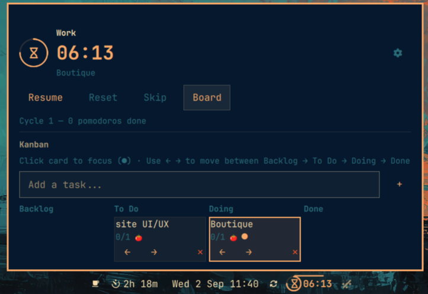

# flowfocus

Pomodoro timer + To-Do list for [Omarchy](https://omarchy.org) — a single bar widget with a rich popup panel.



* **Pomodoro cycle** — Work / Short break / Long break (default `25/5/15` min, every 4 cycles), pause / resume / reset / skip, cycle counter, deadline-based timing that survives bar reloads.
* **Tick sound** — optional soft `tik-tik` every second while the timer runs, toggleable with volume slider (0–1). Source is the *Focus Timer* flatpak’s `clock.ogg` (`io.github.focustimerhq.FocusTimer`).
* **To-Do** — plain list or Kanban (`Backlog / To Do / Doing / Done`). Plain shows a custom checkbox row with `☐ done • ○ focus/● active • → move column • ✕ delete`. Kanban shows 4 × `124px` columns in a `520px` wide board (horizontal scroll) with `← →` to move and `✕` to delete. `Space` toggles start/pause when the panel has focus.
* **Alarm** — 30 s grandfather-clock chime from `https://youtu.be/s8E_Ggf_QsQ` played once on phase end via `pw-play`, plus an `omarchy-notification-send` desktop notification.
* **Bar presence** — idle: large `` icon only; running: progress ring + `MM:SS` with phase color (`accent` = work, `muted` = break, `urgent` = long break). `SUPER + SHIFT + T` toggles the popup.

## Install

### Via Omarchy plugin manager (recommended)

```bash
omarchy plugin add https://github.com/kamal-v8/flowfocus --enable --yes
omarchy bar move flowfocus --section right
```

### Manual

```bash
mkdir -p ~/.config/omarchy/plugins
git clone https://github.com/kamal-v8/flowfocus ~/.config/omarchy/plugins/flowfocus
omarchy-shell shell rescanPlugins
omarchy plugin enable flowfocus
omarchy bar move flowfocus --section right
```

Or copy the directory and add this to `~/.config/omarchy/shell.json`:

```json
{
  "bar": { "layout": { "right": [{ "id": "flowfocus" }] } }
}
```

## Usage

* **Click** bar icon → open/close panel
* **Right-click** bar icon → start / pause
* **Middle-click** → reset
* **SUPER + SHIFT + T** → toggle panel (bound in `~/.config/hypr/bindings.lua`)
* **Space** (panel focused) → start / pause

Inside the panel:

* Timer header shows the progress ring, `MM:SS`, phase label and `Next: <task>` (or the active task). Gear `` collapses Settings.
* **Start / Pause / Resume / Reset / Skip**, `Board ↔ List` quick toggle, cycle info.
* **Settings** (behind gear): Tick sound toggle + volume `Slider` (compact `140px`), Kanban board toggle, plus the same keys are exposed in the bar widget’s `shell.json` schema so you can set them persistently.
* **Tasks / Kanban**: `Add a task…` + `+` (Enter also adds). Plain list rows are focusable; Kanban cards highlight the active task and expose `← →` to move columns.

State lives in `~/.local/state/omarchy/focusflow.json` (`XDG_STATE_HOME` honored) and is written atomically via `FileView`. It stores `timer { phase, status, remainingSec, deadlineMs, completedWorkPhases, activeTaskId }`, `tasks[]` (capped at 200, each `text` ≤200 chars, `column ∈ {backlog,todo,doing,done}`) and `settings`. Corrupt JSON falls back to defaults; numeric settings are clamped (`60–3600s`, `interval 1–12`, `volume 0–1`).

## Configuration

All of these can be set per-instance in `shell.json` under the `flowfocus` entry (they are also mirrored from `~/.local/state/omarchy/focusflow.json` after first run):

| Key | Type | Default | Description |
|---|---|---|---|
| `workSec` | int | `1500` | Work duration (s), clamped 60–3600 |
| `shortBreakSec` | int | `300` | Short break (s) |
| `longBreakSec` | int | `900` | Long break (s) |
| `longBreakInterval` | int | `4` | Work phases before long break |
| `tickEnabled` | bool | `false` | Play tick each second while running |
| `tickVolume` | real | `0.3` | Tick volume 0–1 (`pw-play --volume`) |
| `kanbanMode` | bool | `false` | Board vs plain list |
| `autoStartBreaks` | bool | `false` | Auto-start breaks |
| `autoStartWork` | bool | `false` | Auto-start next work |
| `notificationsEnabled` | bool | `true` | Desktop notification on phase end |

Example `shell.json` entry:

```json
{ "id": "flowfocus", "workSec": 1500, "tickEnabled": true, "tickVolume": 0.5, "kanbanMode": false }
```

## Sounds

* `sounds/tick.wav` — 1s slice from YouTube video `Qgsy8BEsLzg` (Clock Ticking Noise for STUDYING | RELAXING | MEDITATION). Played via `pw-play --volume <0–1>` once per second by a `Timer` (`1000ms`).
* `sounds/alarm.wav` — `30.01s` slice `0:00–0:30` from `https://youtu.be/s8E_Ggf_QsQ` (“1800's Grandfather Clock”, 8 h) cut with `yt-dlp --download-sections "*0:00-0:30"` and used for `playCompleteSound` on phase end. Play it manually with `pw-play --volume 0.5 ~/.config/omarchy/plugins/flowfocus/sounds/alarm.wav` (or `paplay`).

Replace either file in place and `omarchy restart shell` to use your own sound.

## IPC

The bar widget exposes an `IpcHandler` at target `flowfocus`:

```bash
qs ipc -n -p "$OMARCHY_PATH/shell" call flowfocus togglePanel
qs ipc -n -p "$OMARCHY_PATH/shell" call flowfocus start
qs ipc -n -p "$OMARCHY_PATH/shell" call flowfocus pause
qs ipc -n -p "$OMARCHY_PATH/shell" call flowfocus resume
qs ipc -n -p "$OMARCHY_PATH/shell" call flowfocus toggle   # start/pause/resume smart
qs ipc -n -p "$OMARCHY_PATH/shell" call flowfocus reset
qs ipc -n -p "$OMARCHY_PATH/shell" call flowfocus skip
qs ipc -n -p "$OMARCHY_PATH/shell" call flowfocus open
qs ipc -n -p "$OMARCHY_PATH/shell" call flowfocus close
```

Note: `omarchy-shell shell call flowfocus ...` goes through `shell.callIfLoaded` which only routes `panel/overlay/menu` loaders — bar-widget IPC must use the direct `qs ipc call flowfocus ...` form.

Hyprland binding (installed automatically if you keep `~/.config/hypr/bindings.lua` from this repo):

```lua
o.bind("SUPER + SHIFT + T", "flowfocus", "qs ipc -n -p $OMARCHY_PATH/shell call flowfocus togglePanel")
```

## Development

```bash
omarchy plugin validate ~/.config/omarchy/plugins/flowfocus
omarchy-shell shell rescanPlugins
# or
omarchy restart shell
qs ipc -n -p "$OMARCHY_PATH/shell" call flowfocus open
```

* `BarWidget.qml` owns `FileView` at `~/.local/state/omarchy/focusflow.json`, the two `Timer`s, `Model.tick` deadline math and `applyTickState` (`JSON.parse(JSON.stringify(state))`) to force QML re-evaluation.
* `Panel.qml` is hosted inside a `KeyboardPanel` (`QML WlrLayershell`, `cardOrigin` anchored to the bar icon) — do not wrap its content in another `BorderSurface` (that caused the double-border bug).
* `Model.js` is pure logic (`defaultState`, `parse`/`serialize`, `phaseDurationSec`, `tick`, `progress`, `addTask`/`moveTask`/`deleteTask`/`toggleTaskDone`/`setActiveTask`, `playTick`/`playCompleteSound` with path sanitization).

## Bugs fixed in this release

* `Model.mergeDefaults` phase check was `!COLUMNS.indexOf(x) === -1` (always false) — now `COLUMNS.indexOf(x) === -1`. Uses a local `isPlainObject` instead of the fragile global `Util.isPlainObject` and clamps/validates all numeric settings, task count (200), task text length (200), column names, and timer status.
* `Model.addTask` / `Panel.addTaskFromInput` now `trim().slice(0,200)` and rejects empty / over-cap tasks.
* `Model.tickSoundPath` / `alarmSoundPath` now sanitize `pluginDir` (`..` rejected) and return empty on bad input.
* `BarWidget.syncSettingsFromShellJson` now coerces `int/real/bool` types from `shell.json` via `Number()`/`!!` and triggers `applyTickState` after mutating.
* `BarWidget.panelOpen` unused property removed.
* `Panel` plain-list delegate replaced the missing `qs.Ui.CheckBox` / broken `QtQuick.Controls.CheckBox` (rendered as a black square, `checkBox` id missing so `width: parent.width - checkBox.width` → `NaN`) with a custom `18×18` rounded `Rectangle` checkbox.
* Plain-list `Text` width now correctly accounts for all four trailing buttons, `Kanban` `X` was `Item { width: parent.width-60 }` overflowing the `124px` card — now anchored `right: parent.right` inside a fixed `22px` footer `Item`.
* Kanban was `71px` columns in a `340px` panel (cramped). Now `520px` panel in board mode (`base 340 / kanban 520`), `4×124px` columns with `Flickable` horizontal scroll, `280px` height.
* Settings collapsed behind gear `` (default hidden), volume `Slider` compacted `parent.width-50 (~290px)` → `140px`.
* Top `Bar`/`ring` clip: added `anchors.topMargin: Style.space(4)` + `Item { height: Style.space(4) }` breathing + `Row topPadding:2`/`bottomPadding:1`, ring `40→36`.
* Sound: `loudnorm` extraction from `y-FJZSaFh80` produced a choppy beep (silence slices). Switched to a clean `0.35s` slice of the flatpak’s `clock.ogg` for `tick` and kept the `30s` grandfather `alarm` from `s8E_Ggf_QsQ` via `--download-sections`.

## License

MIT — see `LICENSE`. Sound files retain their original licenses: `clock.ogg` © Focus Timer authors (flatpak `io.github.focustimerhq.FocusTimer`), `alarm.wav` slice of the YouTube 8-hour grandfather clock video is used here as an alarm sample — replace it if you need a fully libre alternative.

## Credits

* Built on Omarchy’s `omarchy-shell` / `Quickshell` (`qs.Commons`, `qs.Ui`, `Panel`, `KeyboardPanel`, `WidgetButton`, `BorderSurface`).
* Thanks to the Focus Timer flatpak for the mechanical tick.
