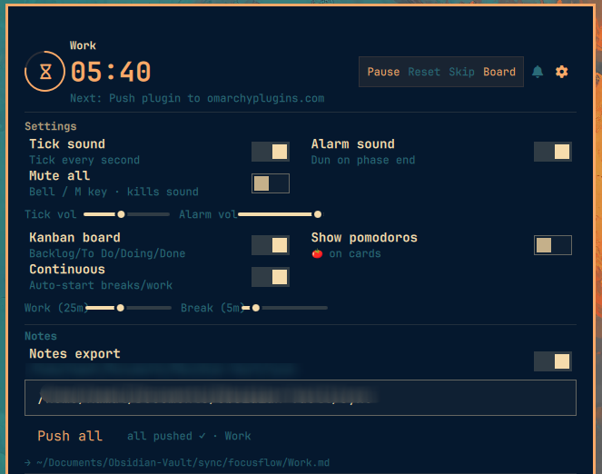

# FocusFlow

Pomodoro timer + To-Do (plain / Kanban) for [Omarchy](https://omarchy.org) — single bar widget, rich popup, minimal resource footprint. Hover shows **FocusFlow**.


* **Pomodoro cycle** — Work / Short break / Long break (default `25/5/15` min, every 4 cycles), pause/resume/reset/skip, cycle counter, deadline-based math survives bar reloads. Single `1000ms` tick timer; ticks muted 30s during alarm to avoid overlap in continuous mode.
* **Sound (lightweight)** — `tick.ogg` (5.3K mono 22k) + `alarm.ogg` (142K mono 22k) + fallback `tick.wav/alarm.wav` mono 22k — was `5.6M` WAV. Played via `pw-play --volume || paplay` with path sanitization (`..` rejected). `tick` every second when enabled, `alarm` once on phase end. Volume sliders now `save+apply` on release.
* **To-Do** — plain list or Kanban (adaptive columns fill the `520px` board, per-column vertical scroll). Plain: custom `18×18` checkbox. Hover pill holds `→ ▲ ▼ ⬆ −`. `Space` start/pause when panel focused.
* **Notes export (Obsidian or any markdown app)** — optional manual export per kanban profile. Plain Markdown, no Obsidian-only syntax, so Obsidian, Logseq, or any text app can read it. Everything lives under `<folder>/focusflow/`, one file per space: `focusflow/Default.md`, `focusflow/<Space>.md`, … Task → `- [ ] task [To Do] — YYYY-MM-DD HH:MM <!-- id -->` (or `[x]` if `Done`). Idempotent `grep -v <!-- id -->`, `⬆`→`↩` undo removes line, `Push all` per active profile, delete-task also removes from notes. Old locations (`FlowFocus.md`, per-space subfolders) auto-migrate on first write.
* **Kanban profiles** — `Default` + up to 20 custom spaces (`Kanban — <Space>` heading). `Spaces:` pill tabs + `+` creator, `Rename`/`Delete` (with `Yes/No` confirm). Switch via click or `Alt+H` / `Alt+L` when FocusFlow focused. Each profile isolated tasks, vault files, and counts.
* **Bar** — idle `` only; running ring + `MM:SS` (`accent` work, dimmed break, `urgent` long break). `SUPER + SHIFT + T` toggles popup.
* **Compact UI** — `SmallToggle` `32px` 2-col grid, `PanelSlider 95px`, timing side-by-side, vault inline, per-column `Flickable` scroll, capped heights, no `ScrollBar` chrome, left accent `3px` + `●` for active task, `-` delete at top-right `z:10`.

## Install
```bash
omarchy plugin add https://github.com/kamal-v8/flowfocus --enable --yes
omarchy bar move flowfocus --section right
# or manual
git clone https://github.com/kamal-v8/flowfocus ~/.config/omarchy/plugins/flowfocus
omarchy-shell shell rescanPlugins; omarchy plugin enable flowfocus
```

`sounds/*.ogg` are 147K total (was 5.6M). Replace in place and `omarchy restart shell` to use your own.

## Usage
* Click → workspace overlay, Right-click → start/pause, Middle → reset, `SUPER+SHIFT+T` → overlay toggle, `Space` (focused) → start/pause (`qs ipc … call flowfocus togglePanel` still opens the quick popup)
* Header: ring + `MM:SS` + phase + `Next: task`. Gear `` collapses compact Settings.
* Controls: Start/Pause/Reset/Skip, Board↔List, cycle `N — M pomodoros`.
* Kanban: `← →` move, `−` delete, `⬆` push (→ `↩` undo), `●` active. Plain: `☐` done, `○/●` focus, hover pill holds `→ ▲ ▼ ⬆ −`.

## Workspace overlay
Fullscreen 3-region UI (icon rail + main + side panels) over the same state. Popup stays for quick access.
```bash
omarchy-shell shell summon flowfocus '{}'                       # open (Focus view)
omarchy-shell shell summon flowfocus '{"view":"kanban"}'        # open Board / todo / settings
omarchy-shell shell hide flowfocus                              # close (or Esc)
```
Suggested keybind: `SUPER + SHIFT + F` → summon. Architecture: overlay reads `focusflow.json` live and acts on it directly; the bar adopts external saves via file watch and re-reads before each tick, so neither surface ever clobbers the other. Keyboard: `Space` start/pause, `Tab` cycle views, `M` mute, `Alt+H/L` spaces, `Esc` close.

State: `~/.local/state/omarchy/focusflow.json` (`XDG_STATE_HOME` honoured, atomic `FileView`). `tasks[]` ≤200×200 chars, `column∈{backlog,todo,doing,done}`, `pushedToObsidian`+`pushedColumn` for idempotency.

## Configuration (`shell.json` `flowfocus` entry)

| Key | Type | Default | Notes |
|---|---|---|---|
| `workSec` | int | 1500 | 60–18000 |
| `shortBreakSec` | int | 300 | 30–1500 |
| `longBreakSec` | int | 900 | 60–3600 |
| `longBreakInterval` | int | 4 | 1–12 |
| `tickEnabled` | bool | false |  |
| `tickVolume` | real | 0.3 | 0–1 |
| `alarmEnabled` | bool | true |  |
| `alarmVolume` | real | 0.5 | 0–1 |
| `kanbanMode` | bool | false | Persisted Board/Todo choice |
| `todoEnabled` | bool | true | Show To-Do view (rail + popup switcher) |
| `kanbanEnabled` | bool | true | Show Kanban view (rail + popup switcher) |
| `showPomodoros` | bool | true |  |
| `autoStartBreaks/Work` | bool | false |  |
| `notificationsEnabled` | bool | true |  |
| `obsidianEnabled` | bool | false |  |
| `obsidianVaultPath` | string | "" | `~/ObsidianVault`, `..`/`;`/`$`/`&`/`|`/`*`/`?` rejected, relative paths resolve under `$HOME` |

Example:
```json
{ "id": "flowfocus", "workSec": 1500, "tickEnabled": true, "obsidianEnabled": true, "obsidianVaultPath": "~/Documents/Obsidian-Vault/sync" }
```

Settings panel (gear icon — sound, board, timing, notes export):



## Remove
```bash
omarchy plugin remove flowfocus
```
State (`~/.local/state/omarchy/focusflow.json`) and exported notes files are left behind — delete them manually if desired.

## Sounds
* `tick.ogg` (5.3K) / `tick.wav` (23K) — 0.5s mono 22k vorbis/PCM from `clock.ogg` (Focus Timer flatpak). `alarm.ogg` (142K) / `alarm.wav` (1.3M) — 30.01s mono 22k from `s8E_Ggf_QsQ` via `yt-dlp --download-sections` + `ffmpeg -ac 1 -ar 22050 -c:a libvorbis -q:a 3 / pcm_s16le`. Play: `pw-play --volume 0.5 ~/.config/omarchy/plugins/flowfocus/sounds/alarm.ogg || pw-play .../alarm.wav` (fallback `paplay`).

## IPC
```bash
qs ipc -n -p "$OMARCHY_PATH/shell" call flowfocus togglePanel
qs ipc -n -p "$OMARCHY_PATH/shell" call flowfocus {start,pause,resume,toggle,reset,skip,open,close}
```

## Security
* `Model.sanitizePluginDir` blocks `..`; `sanitizeVaultPath` blocks `..`/`;`/`&`/`|`/`$`/`\``/`*`/`?`/`<>`/`^()`/`{}`/`[]`/`\`/`'`/`"`/control chars, 500 chars + `sanitizeProfileNameForPath` for `focusflow/<Space>.md` paths. Task text `trim` 200, `\\`/`"`/`$`/`` ` `` escaped before `bash -c` `printf`. Task `column`/`profileId` whitelisted, `done`/`pushed` bool-coerced. All writes `FileView atomicWrites`. `ConfirmDialog` Yes/No for delete task/profile + vault sync.

## Development
```bash
omarchy plugin validate ~/.config/omarchy/plugins/flowfocus
omarchy restart shell
# Alt+H/L cycles kanban profiles when FocusFlow focused
```
* `BarWidget.qml` — `FileView` + single `tickTimer 1000ms` + `alarmMuteTimer 30000ms`, `Model.tick` deadline, `JSON.parse(JSON.stringify(state))` to trigger QML, `cycleProfile`/`moveTaskUp/Down`.
* `Panel.qml` — `KeyboardPanel` (no extra `BorderSurface`), `Flickable` per-column, `SmallToggle: Item 32px`, `Shortcut Alt+H/L`, hover `▲▼` prioritization, `ConfirmDialog` for deletes.
* `Model.js` — pure: `defaultState v2` with `kanbanProfiles/activeKanbanProfileId`, `parse` migration, `phaseDurationSec/tick/progress`, task CRUD + `profileId` + `pushedToObsidian/pushedColumn`, `playTick/alarm` `tick.ogg/wav` fallback, `appendTaskToVault` per-space `focusflow/<Space>.md` idempotent + legacy auto-migration.

## Changelog v1.5.0 (vault layout)
* Vault: single `focusflow/` folder under your vault path, one file per space (`Default.md`, `<Space>.md`, …) — no more hunting across base file vs per-space subfolders. `obsidianFile` setting retired. Old files (`FlowFocus.md`, `<Space>/FlowFocus.md`) auto-move on first write; undo/delete also cleans legacy copies. Panel shows the resolved destination per active space.
* UI: vault path field full-width, `?` help popup, hover action pill, bell/`M` master mute.

## Changelog v1.4.0 (polished)
* Profiles: 20 spaces (`Default` + custom), `Kanban — <Space>` heading, pill tabs + `+` creator, `Alt+H/L` cycle when focused, per-profile tasks/vault files/counts, `Yes/No` confirm on delete.
* Prioritize: `▲ ▼` on hover (plain + kanban) → `moveTaskUp/Down` within `profile+column`, top-right `-` delete `z:10`.
* Sounds: `5.5M+94K WAV` → `142K+5K OGG` + `1.3M+23K WAV` fallback mono 22k, removed `QtQuick.Controls`, single timer + 30s mute — less CPU/IO/mem. Volume sliders `save+apply` on release.
* Vault: per-profile subfolders + `sanitizeProfileNameForPath`, all columns `⬆`→`↩` undo (`removeTaskFromVault` + `clearTaskPushed`), `[ ]` vs `[x]` per `Done`, `<!-- id -->` dedup, `Push all` per active profile, delete task also removes from vault, path `\\` escaped.
* UI: 2-col `SmallToggle`, `95px` sliders, per-column scroll, `580px` board `132px` cols `12px` gaps, left accent `3px` + `●` for active.
* Fixes: `sanitizeVaultPath` blocks `&|*?<>^(){}[]\\'"` + `\` escape, `syncSettingsFromShellJson` coerce, `..` blocks, `Alt+H/L` enable `panel.open` (was `root.opened` bug), `\\` escape in vault line.

## License
MIT — see `LICENSE`. `clock.ogg` © Focus Timer, `alarm.ogg` sample from YouTube grandfather clock — replace for fully libre build.

## Credits
Omarchy `omarchy-shell`/`Quickshell` (`qs.Commons`, `qs.Ui`), Focus Timer flatpak.
