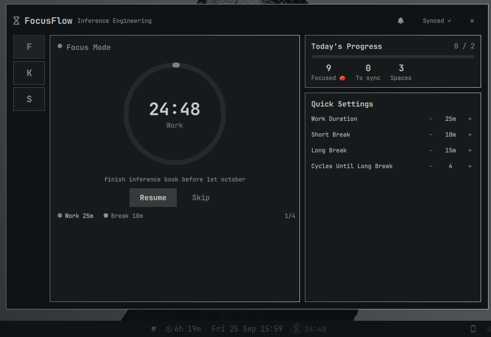

# FocusFlow

Pomodoro timer + To-Do / Kanban for [Omarchy](https://omarchy.org) — a bar widget with a quick popup plus a fullscreen workspace overlay.




* **Pomodoro** — Work / Short / Long breaks (default 25/5/15 min, long every 4), pause/resume/reset/skip, tick + alarm sounds, deadline math survives reloads.
* **Kanban + To-Do** — 4 columns or grouped list, search, per-column add, up to 20 isolated spaces.
* **Notes export** — manual push per task to Obsidian / Logseq / any markdown app (`<folder>/focusflow/<Space>.md`), with undo and legacy auto-migration.

## Install

```bash
omarchy plugin add https://github.com/kamal-v8/flowfocus --enable
omarchy bar move flowfocus --section right
```

## Usage

Bar: **Click** opens the workspace overlay, **Right-click** starts/pauses, **Middle-click** resets.

Overlay (`SUPER + SHIFT + T` toggles it, `Esc` closes):

```bash
omarchy-shell shell summon flowfocus '{"view":"kanban"}'  # open Board / todo / settings directly
```

| Key | Action |
|---|---|
| `Space` | Start / pause timer |
| `Tab` | Cycle Focus → Board → Todo |
| `F` / `K` / `T` / `S` | Jump to Focus / Kanban / To-Do / Setup |
| `M` | Mute / unmute all sound |
| `Alt+H` / `Alt+L` | Previous / next space |
| `Esc` | Close overlay |

Popup (bar widget): `Space` start/pause, `Tab` cycle views, `M` mute, `Alt+H/L` spaces, `?` help. Tasks: `← →` move, `▲ ▼` prioritize, `⬆` push to notes (`↩` undo), `−` delete, `●` focus.

## Configure

Bar settings UI, or `shell.json` `flowfocus` entry:

| Key | Type | Default |
|---|---|---|
| `workSec` / `shortBreakSec` / `longBreakSec` | int | 1500 / 300 / 900 |
| `longBreakInterval` | int | 4 |
| `tickEnabled` / `tickVolume` | bool / real | false / 0.3 |
| `alarmEnabled` / `alarmVolume` | bool / real | true / 0.5 |
| `soundMuted` | bool | false |
| `kanbanMode` | bool | false |
| `todoEnabled` / `kanbanEnabled` | bool | true / true |
| `showPomodoros` / `notificationsEnabled` | bool | true / true |
| `obsidianEnabled` / `obsidianVaultPath` | bool / string | false / "" |

Setup view (overlay `S`, popup gear):


State lives in `~/.local/state/omarchy/focusflow.json`. Replace `sounds/*.ogg|wav` in place + `omarchy restart shell` for custom audio.

## Remove

```bash
omarchy plugin remove flowfocus
```

State file and exported notes are left behind — delete them manually if desired.

## Security

* All external binaries are absolute trusted identities (`/usr/bin/*`); nothing resolves via ambient `PATH`. Shell is used only for the player fallback chain and vault pipelines.
* Vault writes go through same-directory `mktemp` O_EXCL temps with atomic rename over verified non-symlinks; reads are bounded (regular file, euid-owned, ≤1MiB); guarded targets abort instead of being overwritten.
* Vault paths reject `..` and shell metachars; task text is length-capped and escaped; deletes ask first.

## License

MIT — see `LICENSE`.
